```mermaid
flowchart TD
    U([👤 Utente]) --> R{Richiesta API}
    R --> AC{Access Control Check}
    AC -->|✅ Autorizzato| D[(Database)]
    AC -->|❌ Non autorizzato| E[403 Forbidden]
    AC -->|⚠️ ASSENTE o ROTTO| D
    D --> RES([📄 Risposta])
    
    style AC fill:#ff6b6b,color:#fff
    style E fill:#51cf66,color:#fff
    style D fill:#339af0,color:#fff
```

# 🔐 Broken Access Control

**Secure Code Academy** — Laboratorio pratico

<div class="pt-4 text-gray-300">
  OWASP Top 10:2025 #1 · OWASP API Security 2023 #1
</div>

<div class="abs-br m-6 flex gap-2">
  <a href="https://github.com/lab-sca/lab-broken-access-control" target="_blank" 
     class="text-xl icon-btn opacity-50 !border-none !hover:text-white">
    <carbon-logo-github />
  </a>
</div>

---
layout: default
---

# Agenda

<div class="grid grid-cols-2 gap-6 mt-4">

<div>

### Teoria
1. 🎯 Cos'è il Broken Access Control
2. 📊 Dati e impatto (OWASP 2025)
3. 🔎 Tipologie di vulnerabilità
4. 🌐 OWASP API Security: BOLA
5. 🛡️ Remediation & Best Practice

</div>

<div>

### Pratica
6. 🧪 Struttura del laboratorio
7. 🔷 Versione Quarkus
8. 🍃 Versione Spring Boot
9. 💻 Scenari di attacco
10. ✅ Verifica e soluzione

</div>

</div>

---
layout: section
---

# Cos'è il Broken Access Control?

---
layout: two-cols
---

# Broken Access Control

Il controllo degli accessi garantisce che gli utenti **non possano agire al di fuori dei loro permessi previsti**.

Un fallimento di questo meccanismo porta tipicamente a:

- **Divulgazione non autorizzata** di informazioni
- **Modifica o distruzione** di dati altrui
- **Esecuzione di funzioni privilegiate** senza averne il diritto

::right::

<div style="transform: scale(0.7); transform-origin: top left;">

</div>

---
layout: default
---

# OWASP Top 10:2025 — #1

<div class="grid grid-cols-3 gap-4 mt-6">

<div class="bg-red-900 bg-opacity-40 rounded-lg p-4 border border-red-500">
  <div class="text-3xl font-bold text-red-400">100%</div>
  <div class="text-sm mt-1">delle applicazioni testate presenta qualche forma di BAC</div>
</div>

<div class="bg-orange-900 bg-opacity-40 rounded-lg p-4 border border-orange-500">
  <div class="text-3xl font-bold text-orange-400">1.8M+</div>
  <div class="text-sm mt-1">occorrenze rilevate nei dati raccolti</div>
</div>

<div class="bg-yellow-900 bg-opacity-40 rounded-lg p-4 border border-yellow-500">
  <div class="text-3xl font-bold text-yellow-400">32.654</div>
  <div class="text-sm mt-1">CVE correlati — il secondo numero più alto in assoluto</div>
</div>

</div>

<div class="mt-6 text-sm text-gray-400">

| Metrica | Valore |
|--------|--------|
| CWE mappate | 40 |
| Max Incidence Rate | 20,15% |
| Avg Weighted Exploit | 7,04 / 10 |
| Avg Weighted Impact | 3,84 / 10 |

</div>

<div class="mt-4 text-xs text-gray-500">
  Fonte: <a href="https://owasp.org/Top10/2025/A01_2025-Broken_Access_Control/" class="text-blue-400">OWASP Top 10:2025 — A01</a>
</div>

---
layout: default
---

# Tipologie di Vulnerabilità

<div class="grid grid-cols-2 gap-4 mt-2 text-sm">

<div class="bg-gray-800 rounded-lg p-3 border-l-4 border-red-500">
  <div class="font-bold text-red-400">🔓 Violazione del Least Privilege</div>
  <div class="mt-1 text-gray-300">Risorse accessibili a chiunque invece che solo agli utenti autorizzati</div>
</div>

<div class="bg-gray-800 rounded-lg p-3 border-l-4 border-orange-500">
  <div class="font-bold text-orange-400">🔗 IDOR — Insecure Direct Object Reference</div>
  <div class="mt-1 text-gray-300">Accedere all'account altrui modificando un ID nella richiesta</div>
</div>

<div class="bg-gray-800 rounded-lg p-3 border-l-4 border-yellow-500">
  <div class="font-bold text-yellow-400">🚀 Privilege Escalation</div>
  <div class="mt-1 text-gray-300">Agire come utente non autenticato, o ottenere privilegi admin senza averne diritto</div>
</div>

<div class="bg-gray-800 rounded-lg p-3 border-l-4 border-purple-500">
  <div class="font-bold text-purple-400">🌐 CORS Misconfiguration</div>
  <div class="mt-1 text-gray-300">Configurazione errata che permette accesso API da origini non autorizzate</div>
</div>

<div class="bg-gray-800 rounded-lg p-3 border-l-4 border-blue-500">
  <div class="font-bold text-blue-400">🔑 JWT / Metadata Manipulation</div>
  <div class="mt-1 text-gray-300">Replay o tampering di token JWT per elevare i propri privilegi</div>
</div>

<div class="bg-gray-800 rounded-lg p-3 border-l-4 border-green-500">
  <div class="font-bold text-green-400">🗺️ Force Browsing</div>
  <div class="mt-1 text-gray-300">Accedere direttamente a URL privilegiati senza autenticazione</div>
</div>

</div>

---
layout: default
---

# Come Funziona un Attacco IDOR

```mermaid
sequenceDiagram
    actor Attacker as 👿 Attaccante
    participant API as 🖥️ API Server
    participant DB as 🗄️ Database

    Note over Attacker: L'attaccante è autenticato come user_id=42
    
    Attacker->>API: GET /api/documents/100 (proprio documento)
    API->>DB: SELECT * FROM docs WHERE id=100
    DB-->>API: { id:100, owner:42, content:"..." }
    API-->>Attacker: ✅ 200 OK — documento ricevuto

    Note over Attacker: Modifica l'ID nella richiesta...
    
    Attacker->>API: GET /api/documents/101 (documento altrui!)
    API->>DB: SELECT * FROM docs WHERE id=101
    Note over API: ⚠️ Nessun controllo owner == current_user!
    DB-->>API: { id:101, owner:99, content:"SEGRETO" }
    API-->>Attacker: ✅ 200 OK — dati rubati! 😱
```

<div style="transform: scale(0.7); transform-origin: top left;">

</div>

---
layout: section
---

# OWASP API Security Top 10
## API1:2023 — Broken Object Level Authorization (BOLA)

---
layout: two-cols
---

# BOLA — Perché le API sono a rischio

Le API sono particolarmente vulnerabili perché:

- Il server **non traccia lo stato** del client
- Le decisioni di accesso si basano su **parametri inviati dal client** (object ID, VIN, documentId...)
- La risposta HTTP è spesso **sufficiente** per capire se l'attacco ha avuto successo

<br>

> **BOLA ≠ BFLA**  
> In BOLA l'endpoint è accessibile, il problema è a livello di **oggetto**.  
> In BFLA (API5) l'utente non dovrebbe accedere all'endpoint stesso.

::right::

### Scenario reale

```http
# Utente autenticato accede al proprio profilo
GET /api/v1/users/1337/profile
Authorization: Bearer eyJ...

# Attaccante prova ad accedere ad altri utenti
GET /api/v1/users/1338/profile  ← ID modificato
GET /api/v1/users/1/profile     ← Prova admin!
Authorization: Bearer eyJ...    ← Stesso token!
```

<br>

**Rischi concreti:**
- Data breach
- Manipolazione dati altrui
- Account takeover completo

---
layout: default
---

# Confronto: OWASP Top 10 vs API Security

```mermaid
graph LR
    subgraph TOP10["🌐 OWASP Top 10:2025"]
        A01["A01 — Broken Access Control\n(100% applicazioni)"]
    end
    
    subgraph API["🔌 OWASP API Security 2023"]
        API1["API1 — BOLA\n(Object Level)"]
        API5["API5 — BFLA\n(Function Level)"]
        API3["API3 — Broken Object\nProperty Level Auth"]
    end
    
    A01 -->|"include"| API1
    A01 -->|"include"| API5
    A01 -->|"include"| API3
    
    style A01 fill:#e03131,color:#fff
    style API1 fill:#c2255c,color:#fff
    style API5 fill:#862e9c,color:#fff
    style API3 fill:#5c7cfa,color:#fff
```



<div class="mt-4 text-sm text-gray-400">
Il Broken Access Control nell'OWASP Top 10 è una categoria "ombrello" che copre tutti i sotto-tipi di autorizzazione rotta, inclusi quelli specifici per le API.
</div>

---
layout: section
---

# Remediation & Best Practice

---
layout: default
---

# Come Prevenire il BAC

<div class="grid grid-cols-2 gap-4 mt-2 text-sm">

<div class="bg-green-900 bg-opacity-30 rounded-lg p-4 border border-green-600">

### ✅ Lato Server
- **Deny by default**: nega tutto ciò che non è esplicitamente permesso
- Implementa i controlli di accesso **una sola volta** e riusali
- Valida che l'utente sia il proprietario della risorsa (**record ownership**)
- Centralizza la logica di autorizzazione (no duplicazioni!)

</div>

<div class="bg-blue-900 bg-opacity-30 rounded-lg p-4 border border-blue-600">

### 🔑 Gestione Token e Sessioni
- Invalida i session token **lato server** al logout
- Usa JWT **short-lived** (breve durata)
- Per JWT long-lived: usa **refresh token** con revoca OAuth2
- Non basarti mai su claim del token senza validarli

</div>

<div class="bg-purple-900 bg-opacity-30 rounded-lg p-4 border border-purple-600">

### 🌐 API & CORS
- Disabilita il **directory listing** del server
- Minimizza l'uso di CORS, configura allowed origins in modo restrittivo
- Applica **rate limiting** su endpoint API e controller
- Rimuovi backup e metadata (.git) dalla web root

</div>

<div class="bg-yellow-900 bg-opacity-30 rounded-lg p-4 border border-yellow-600">

### 🧪 Test & Monitoring
- Scrivi **unit e integration test** per il controllo accessi
- **Logga** ogni fallimento di accesso e avvisa gli admin
- Usa **GUID casuali** come ID degli oggetti (non ID sequenziali!)
- Includi test di autorizzazione nelle pipeline CI/CD

</div>

</div>

---
layout: default
---

# Pattern di Autorizzazione: Esempio Java

<div class="grid grid-cols-2 gap-4">

<div>

### ❌ Vulnerabile

```java
// IDOR: nessun controllo ownership
@GET
@Path("/documents/{id}")
public Document getDocument(@PathParam("id") Long id) {
    // Chiunque può leggere qualsiasi documento!
    return documentRepository.findById(id);
}
```

</div>

<div>

### ✅ Sicuro

```java
@GET
@Path("/documents/{id}")
@RolesAllowed("user")
public Document getDocument(
    @PathParam("id") Long id,
    @Context SecurityContext ctx) {
    
    Document doc = documentRepository.findById(id);
    
    // Verifica che l'utente sia il proprietario
    String currentUser = ctx.getUserPrincipal().getName();
    if (!doc.getOwner().equals(currentUser)) {
        throw new ForbiddenException("Accesso negato");
    }
    return doc;
}
```

</div>

</div>

---
layout: section
---

# Il Laboratorio

---
layout: default
---

# Struttura del Laboratorio

```mermaid
graph TD
    MAIN["📦 lab-broken-access-control\n(Repository principale)"]
    Q["🔷 lab-broken-access-control-quarkus\n(Versione Quarkus)"]
    S["🍃 lab-broken-access-control-springboot\n(Versione Spring Boot)"]
    
    MAIN -->|fork / scegli| Q
    MAIN -->|fork / scegli| S
    
    Q --> QT["Quarkus · MicroProfile\nJAX-RS · SmallRye JWT\nPanache · Fugerit Venus Doc"]
    S --> ST["Spring Boot · Spring MVC\nOAuth2 Resource Server\nSpring Data JPA · Fugerit Venus Doc"]
    
    style MAIN fill:#1971c2,color:#fff
    style Q fill:#4263eb,color:#fff
    style S fill:#2f9e44,color:#fff
```

<div style="transform: scale(0.7); transform-origin: top left;">

</div>

<div class="mt-4 text-sm text-gray-400">
  Repository principale: <a href="https://github.com/lab-sca/lab-broken-access-control" class="text-blue-400">github.com/lab-sca/lab-broken-access-control</a>
</div>

---
layout: two-cols
---

# 🔷 Versione Quarkus

**Cloud-native, supersonic, subatomic Java**

### Quick Start

```bash
git clone https://github.com/lab-sca/\
  lab-broken-access-control-quarkus.git
cd lab-broken-access-control-quarkus
mvn quarkus:dev
```

### Tecnologie

- **Quarkus** + MicroProfile
- **JAX-RS** per le REST API
- **SmallRye JWT** per l'autenticazione
- **Panache** per la persistenza
- **Fugerit Venus Doc** per i report

::right::

# 🍃 Versione Spring Boot

**Il framework Java più diffuso per microservizi**

### Quick Start

```bash
git clone https://github.com/lab-sca/\
  lab-broken-access-control-springboot.git
cd lab-broken-access-control-springboot
mvn spring-boot:run
```

### Tecnologie

- **Spring Boot** standalone
- **Spring MVC** per le REST API
- **OAuth2 Resource Server** per JWT
- **Spring Data JPA** per la persistenza
- **Fugerit Venus Doc** per i report

---
layout: default
---

# Scenari di Attacco del Lab

<div class="mt-4 space-y-3">

<div class="bg-gray-800 rounded-lg p-4 border-l-4 border-red-500">
  <div class="flex items-center gap-2">
    <span class="text-red-400 font-bold">Scenario 1 — IDOR su Risorsa Personale</span>
    <span class="text-xs bg-red-900 text-red-300 px-2 py-0.5 rounded">OWASP API1</span>
  </div>
  <div class="mt-1 text-sm text-gray-300">
    L'utente autenticato può accedere a documenti/risorse di altri utenti semplicemente modificando l'ID nel path della richiesta.
  </div>
</div>

<div class="bg-gray-800 rounded-lg p-4 border-l-4 border-orange-500">
  <div class="flex items-center gap-2">
    <span class="text-orange-400 font-bold">Scenario 2 — Missing Authorization su Endpoint Admin</span>
    <span class="text-xs bg-orange-900 text-orange-300 px-2 py-0.5 rounded">OWASP A01</span>
  </div>
  <div class="mt-1 text-sm text-gray-300">
    Endpoint amministrativi accessibili senza la verifica del ruolo admin — un utente normale ottiene accesso privilegiato.
  </div>
</div>

<div class="bg-gray-800 rounded-lg p-4 border-l-4 border-yellow-500">
  <div class="flex items-center gap-2">
    <span class="text-yellow-400 font-bold">Scenario 3 — JWT Claims Manipulation</span>
    <span class="text-xs bg-yellow-900 text-yellow-300 px-2 py-0.5 rounded">OWASP A01</span>
  </div>
  <div class="mt-1 text-sm text-gray-300">
    Manipolazione dei claims JWT per falsificare il ruolo utente o l'identità, sfruttando una validazione insufficiente lato server.
  </div>
</div>

</div>

---
layout: default
---

# Come Affrontare il Laboratorio

<div class="grid grid-cols-3 gap-4 mt-4 text-center text-sm">

<div class="bg-gray-800 rounded-xl p-4">
  <div class="text-3xl mb-2">1️⃣</div>
  <div class="font-bold text-blue-400">Esplora</div>
  <div class="mt-2 text-gray-300">Clona il repository, avvia l'applicazione e analizza le API disponibili con Swagger UI o curl</div>
</div>

<div class="bg-gray-800 rounded-xl p-4">
  <div class="text-3xl mb-2">2️⃣</div>
  <div class="font-bold text-yellow-400">Attacca</div>
  <div class="mt-2 text-gray-300">Prova a sfruttare le vulnerabilità: modifica gli ID, chiama endpoint admin, manipola i token JWT</div>
</div>

<div class="bg-gray-800 rounded-xl p-4">
  <div class="text-3xl mb-2">3️⃣</div>
  <div class="font-bold text-green-400">Correggi</div>
  <div class="mt-2 text-gray-300">Implementa la soluzione: aggiungi i controlli di autorizzazione mancanti e verifica che gli attacchi non funzionino più</div>
</div>

</div>

<div class="mt-6 bg-blue-900 bg-opacity-30 rounded-lg p-4 border border-blue-600 text-sm">
  💡 <strong>Suggerimento:</strong> Ogni scenario ha un branch <code>solution</code> con la correzione implementata. Prova prima da solo, poi confronta!
</div>

---
layout: default
---

# Checklist di Verifica

Usa questa lista per verificare che le tue fix siano complete:

<div class="grid grid-cols-2 gap-4 mt-4 text-sm">

<div>

### Controllo Accessi
- [ ] Ogni endpoint verifica l'autenticazione
- [ ] Ogni operazione su risorse verifica l'ownership
- [ ] Gli endpoint admin verificano il ruolo `ADMIN`
- [ ] Il deny-by-default è il comportamento predefinito

</div>

<div>

### Token & Sessioni
- [ ] I JWT hanno una scadenza breve (`exp`)
- [ ] I claims JWT sono validati lato server
- [ ] Il logout invalida effettivamente la sessione
- [ ] Non si fidano dei dati del client senza verifica

</div>

<div>

### Test
- [ ] Esiste un test che verifica l'IDOR e fallisce pre-fix
- [ ] Esiste un test per l'accesso admin non autorizzato
- [ ] I test passano dopo le correzioni
- [ ] I test sono integrati nella pipeline CI

</div>

<div>

### Monitoring
- [ ] I tentativi di accesso negato vengono loggati
- [ ] Il log include user, risorsa e timestamp
- [ ] Esiste un alert per accessi ripetuti negati

</div>

</div>

---
layout: default
---

# Riferimenti e Risorse

<div class="grid grid-cols-2 gap-4 mt-4 text-sm">

<div>

### OWASP
- [OWASP Top 10:2025 — A01 Broken Access Control](https://owasp.org/Top10/2025/A01_2025-Broken_Access_Control/)
- [OWASP API Security 2023 — API1 BOLA](https://owasp.org/API-Security/editions/2023/en/0xa1-broken-object-level-authorization/)
- [OWASP Authorization Cheat Sheet](https://cheatsheetseries.owasp.org/cheatsheets/Authorization_Cheat_Sheet.html)
- [OWASP Proactive Controls: C1 Access Control](https://top10proactive.owasp.org/archive/2024/the-top-10/c1-accesscontrol/)
- [OWASP ASVS V8 Authorization](https://github.com/OWASP/ASVS/blob/master/5.0/en/0x17-V8-Authorization.md)

</div>

<div>

### Laboratorio
- [📦 Repository principale](https://github.com/lab-sca/lab-broken-access-control)
- [🔷 Lab Quarkus](https://github.com/lab-sca/lab-broken-access-control-quarkus)
- [🍃 Lab Spring Boot](https://github.com/lab-sca/lab-broken-access-control-springboot)

### Strumenti Utili
- [Fugerit Venus Doc](https://venusdocs.fugerit.org/)
- [PortSwigger Web Academy — Access Control](https://portswigger.net/web-security/access-control)
- [OAuth 2.0 — Revoking Access](https://www.oauth.com/oauth2-servers/listing-authorizations/revoking-access/)

</div>

</div>

---
layout: end
---

# Buon Laboratorio! 🚀

<div class="mt-4 text-gray-400">

Domande? Apri una issue su GitHub o contatta il team **Secure Code Academy**

</div>

<div class="mt-6 flex gap-4 justify-center text-sm">
  <a href="https://github.com/lab-sca/lab-broken-access-control" class="text-blue-400 hover:text-blue-300">
    🔗 github.com/lab-sca/lab-broken-access-control
  </a>
</div>

<div class="mt-8 text-xs text-gray-600">
  Basato su OWASP Top 10:2025 · OWASP API Security Top 10:2023 · Licenza MIT
</div>
